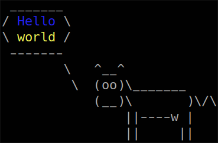

# multicow - cowsay with multi-bubble support

## Features

All standard .cow files from the original cowsay are supported.
Custom cow files may not be, because they are actually perl scripts and only a tiny subset of possible perl statements will work.

Eye and tongue customisation is supported.

New features: line feed support, multiple bubbles, height limit, bottom alignment, text colour.

## Installation

Install the original cowsay so that cow files are in /usr/share/cowsay/cows/ (or do something if another path needs to be used).

Copy multicow.py to ~/bin/multicow or such

## Usage

```
multicow [-h] [-l] [-f COWFILE] [-m] [-e EYES] [-T TONGUE] [-W WIDTH] [-H HEIGHT]
[--think] [--bottom] [content ...]

positional arguments:
  content               message to show, read from standard input if none is
                        given

options:
  -h, --help            show this help message and exit
  -l, --list            lists the defined cows on the current COWPATH
  -f COWFILE, --file COWFILE
                        specifies a particular cow picture file (cowfile) to
                        use
  -m, --multi           put multiple message argument into multiple bubbles
  -e EYES, --eyes EYES  selects the appearance of the cow’s eyes (default oo),
                        should be two characters
  -T TONGUE, --tongue TONGUE
                        selects the appearance of the cow’s tongue, should be
                        two characters
  -W WIDTH, --width WIDTH
                        wrap words in the message to given width
  -H HEIGHT, --height HEIGHT
                        truncate message (including bubbles, excluding the cow)
                        to given number of lines; in multi-bubble mode, top-most
                        bubbles are omitted if they do not fit
  --think               use cowthink bubbles
  --bottom              in conjunction with -H, add empty lines at the top up to
                        exactly the height limit
```

## Examples

Multiple bubbles (originally intended to be used to display twitch chat, which has yet to happen):

```
multicow -m -W 20 -H 13 "this is the first line which gets truncated" \
"this is the second line" "this is the third line"
 ______________________
< this is the first... >
 ----------------------
       \
 ____________________
/ this is the second \
\ line               /
 --------------------
       \
 ___________________
/ this is the third \
\ line              /
 -------------------
        \   ^__^
         \  (oo)\_______
            (__)\       )\/\
                ||----w |
                ||     ||
```

Bottom-aligned cow, which can be useful for changing graphics where the cow stays in place while bubble changes height:

```
multicow --bottom -H 5 "short line"


 ____________
< short line >
 ------------
        \   ^__^
         \  (oo)\_______
            (__)\       )\/\
                ||----w |
                ||     ||
```

This cow can take line feeds from command line:

```
$ multicow "two
> lines"
 _______
/ two   \
\ lines /
 -------
        \   ^__^
         \  (oo)\_______
            (__)\       )\/\
                ||----w |
                ||     ||
```

Escape sequences for text colour are supported:

```
multicow -W 10 "$(tput setaf 4)Hello $(tput setaf 11)world"
```


And it can be invoked as a python function:

```
>>> import multicow
>>> multicow.cowsay(multicow.loadcow("/usr/share/cowsay/cows/default.cow"), \
"one line", multicow.make_argparser().parse_args(["-e", "oO"]))
 __________
< one line >
 ----------
        \   ^__^
         \  (oO)\_______
            (__)\       )\/\
                ||----w |
                ||     ||
>>> multicow.cowsay(multicow.loadcow("/usr/share/cowsay/cows/default.cow"), \
["two", "lines"], multicow.make_argparser().parse_args(["-e", "oO", "-m"]))
 _____
< two >
 -----
       \
 _______
< lines >
 -------
        \   ^__^
         \  (oO)\_______
            (__)\       )\/\
                ||----w |
                ||     ||
```

## Possibly asked questions

Q: Why no type annotations in the code? Why not a proper python package? Why not on pip?  
A: I'm not a python expert (but python's better than perl, that's for sure).

Q: Why GPLv3?  
A: Original cowsay has that license, so just in case. I don't actually care.
